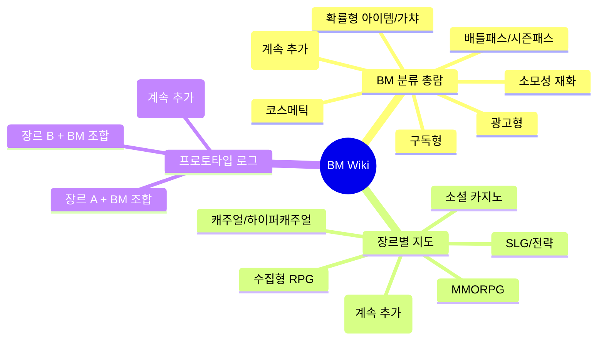

# BM Wiki

> 게임 분석은 누구나 한다. 이 위키는 그 다음 단계를 위한 것이다 —
> **재미 요소를 들으면 BM이 쏟아져 나오는 사람**이 되기 위한 개인 지식 체계다.

이 위키는 세 축으로 쌓인다.

1. **[BM 분류 총람](bm-catalog/index.md)** — BM(수익모델) 자체를 종류별로 분해한다. 정의, 등장 배경과 역사, 시대별 대표 사례, 어떤 재미 요소·장르에 붙는지, 붙였을 때의 부작용까지.
2. **[장르별 지도](genres/index.md)** — 장르마다 핵심 재미 요소를 짚고, 거기에 어떤 BM이 적합한지 / 과한지 / 아직 아무도 안 써본 조합인지 판단을 쌓는다.
3. **[프로토타입 로그](prototypes/index.md)** — 장르별로 핵심 재미 요소만 담은 프로토타입을 만들고, 실제로 BM을 붙여보며 얻은 인사이트를 기록한다. 이론이 아니라 관록.

## 전체 지도

## 이 위키의 규칙

- **분류가 먼저, 사례는 그 다음.** 게임 하나를 파는 게 아니라, 그 게임이 어떤 분류 칸에 들어가는지가 중요하다.
- **역사 없는 판단은 관록이 아니다.** 왜 이 BM이 이 시점에 등장했는지, 무엇의 진화형인지 항상 적는다.
- **모든 항목은 초안이다.** 확실하지 않은 사실은 "검증 필요"로 표시하고, 확인되면 지운다. 틀린 관록보다 빈 칸이 낫다.
- **새 항목을 추가할 땐** 저장소 루트의 `workflows/add-bm-entry.md` 절차를 따른다. (이 파일은 위키 사이트가 아니라 저장소에 있음)
